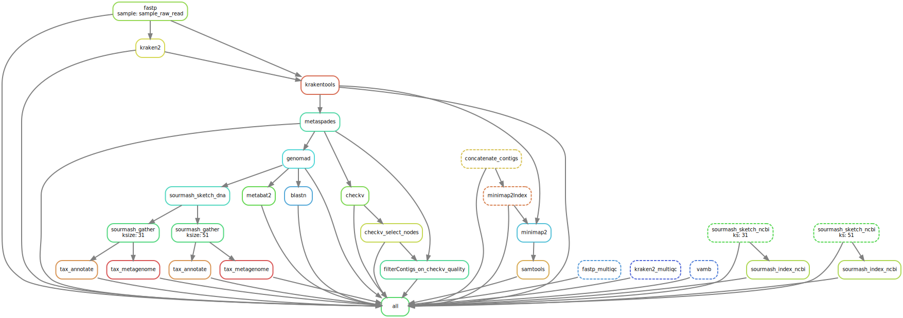

# viral_metagenomics_pipeline


## Workflow DAG
Summary of the snakemake jobs (example with toy dataset)




## Installation


requirements:
- conda: Instructions on installing miniconda can be installed [here](https://docs.conda.io/projects/miniconda/en/latest/miniconda-install.html)


```
$ git clone https://git.wur.nl/lenarotoluka.lmelias/viral_metagenomics_pipeline.git
```


- Setup snakemake conda environment:

create a snakemake conda environment similar to the one used in making the pipeline, to avoid issues that may arise from other version of snakemake

(you might already have a conda environment named snakemake; you could use a different name for this one)
```
$ conda env create -n snakemake --file ./tools/yamls/snakemake.yml
```

Activate the snakemake conda env; and cd into scripts directory, all the analysis will be run in the scripts directory
```
$ conda activate snakemake; cd ../scripts
```

## Usage

I recommend running the pipeline step by step for ease of fixing errors that you will likely encouter :)


Parameters for the tools used can be changed as necessary in this [config](https://git.wur.nl/lenarotoluka.lmelias/viral_metagenomics_pipeline/-/blob/main/configs/config.yaml?ref_type=heads)

##### *Change slurm params e.g. email here*: [slurm_defaults.yaml](https://git.wur.nl/lenarotoluka.lmelias/viral_metagenomics_pipeline/-/blob/main/configs/slurm_defaults.yaml?ref_type=heads)

### 1.  Raw reads quality checks: [fastp](https://git.wur.nl/lenarotoluka.lmelias/viral_metagenomics_pipeline/-/blob/main/scripts/fastp.smk)

```
$ snakemake -p -j 36  --profile slurmProfile --until fastp
```

Merge fastp reports into one report with multiqc
```
$ snakemake -p -j 36  --profile slurmProfile --until fastp_multiqc
```

### 2.  pre-assembly classification: [Kraken2](https://git.wur.nl/lenarotoluka.lmelias/viral_metagenomics_pipeline/-/blob/main/scripts/kraken2.smk)

```
$ snakemake -p -j 36  --profile slurmProfile --until kraken2
```
Merge kraken2 reports into one report using multiqc
```
$ snakemake -p -j 36  --profile slurmProfile --until kraken2_multiqc
```

### 3.  Host-exclusion: [Krakentools](https://git.wur.nl/lenarotoluka.lmelias/viral_metagenomics_pipeline/-/blob/main/scripts/krakentools.smk)

```
$ snakemake -p -j 36  --profile slurmProfile --until krakentools
```


### 4.  Metagenome Assembly: [metaSPADes](https://git.wur.nl/lenarotoluka.lmelias/viral_metagenomics_pipeline/-/blob/main/scripts/metaspades.smk)

```
$ snakemake -p -j 36  --profile slurmProfile --until metaspades
```

### 5.  Assembly quality checks: [checkV](https://git.wur.nl/lenarotoluka.lmelias/viral_metagenomics_pipeline/-/blob/main/scripts/checkv.smk)

change config to download checkv db first (link to the params config)

```
$ snakemake -p -j 36  --profile slurmProfile --until checkv
```
### 6.  Select good quality contigs: [checkv_select_nodes](https://git.wur.nl/lenarotoluka.lmelias/viral_metagenomics_pipeline/-/blob/main/scripts/selected_checkv_nodes.py) & filterContigs_on_checkv_quality

contigs can be filtered based on checkv completeness. define your completenes threshold at checkv params 
and run the part below

Skip to step 7 if you do not wish to filtere 

checkv_select_nodes
```
$ snakemake -p -j 36  --profile slurmProfile --until checkv_select_nodes
```


filterContigs_on_checkv_quality
```
$ snakemake -p -j 36  --profile slurmProfile --until filterContigs_on_checkv_quality
```

CheckV analysis notebook: [analyse_checkv.ipynb](https://git.wur.nl/lenarotoluka.lmelias/viral_metagenomics_pipeline/-/blob/main/scripts/analyse_checkv.ipynb?ref_type=heads)

### 7.  viral contig prediction: [geNomad](https://git.wur.nl/lenarotoluka.lmelias/viral_metagenomics_pipeline/-/blob/main/scripts/genomad.smk)

```
$ snakemake -p -j 36  --profile slurmProfile --until genomad
```


### 8.  viral contig identification: [BLASTn](https://git.wur.nl/lenarotoluka.lmelias/viral_metagenomics_pipeline/-/blob/main/scripts/blast.smk)


```
$ snakemake -p -j 36  --profile slurmProfile --until blastn
```
geNomad & BLASTn analysis notebook: [analyse_geNomad_and_blast.ipynb](https://git.wur.nl/lenarotoluka.lmelias/viral_metagenomics_pipeline/-/blob/main/scripts/analyse_geNomad_and_blast.ipynb?ref_type=heads)
### 9.  Metagenome binning: [Metabat2](https://git.wur.nl/lenarotoluka.lmelias/viral_metagenomics_pipeline/-/blob/main/scripts/metabat2.smk)

```
$ snakemake -p -j 36  --profile slurmProfile --until metabat2
```

### 9.  Metagenome binning: [VAMB](https://git.wur.nl/lenarotoluka.lmelias/viral_metagenomics_pipeline/-/blob/main/scripts/vamb.smk)

VAMB inlvolves a number of steps

1. Concatenate all the contigs from metaspades to a single file: [concatenate_contigs](https://git.wur.nl/lenarotoluka.lmelias/viral_metagenomics_pipeline/-/blob/main/scripts/concatenateContigs.py)

```
$ snakemake -p -j 36  --profile slurmProfile --until concatenate_contigs
```

2. Create a minimap index of the concatenated contigs: minimapindex

```
$ snakemake -p -j 36  --profile slurmProfile --until minimap2Index
```

3. Map the contigs back their samples: minimap
```
$ snakemake -p -j 36  --profile slurmProfile --until minimap2
```

4. Generate sorted bam files: samtools view & sort
```
$ snakemake -p -j 36  --profile slurmProfile --until samtools
```

5. And finally run VAMB
```
$ snakemake -p -j 36  --profile slurmProfile --until vamb
```

VAMB & Metabat2 bins analysis notebook: [analyse_binning.ipynb](https://git.wur.nl/lenarotoluka.lmelias/viral_metagenomics_pipeline/-/blob/main/scripts/analyse_binning.ipynb?ref_type=heads)

### 10.  Taxonomic profilling: [Sourmash](https://git.wur.nl/lenarotoluka.lmelias/viral_metagenomics_pipeline/-/blob/main/scripts/sourmash.smk)
Sourmash also has a number of steps

indexing and creating signatures may take time depending on your datasize

Sourmash parameters can be changed in this [config](https://git.wur.nl/lenarotoluka.lmelias/viral_metagenomics_pipeline/-/blob/main/configs/sourmash_config.yaml?ref_type=heads) as necessary.

1. Generate ncbi database signature

```
$ snakemake -p -j 36  --profile slurmProfile --until sourmash_sketch_ncbi
```
2. Index the ncbi siganture to create an on disk SBT

```
$ snakemake -p -j 36  --profile slurmProfile --until sourmash_index_ncbi
```
3. create signature of the query sequences/contigs/reads

```
$ snakemake -p -j 36  --profile slurmProfile --until sourmash_sketch_dna
```

4. Query the ncbi signature/sbt using sourmash gather
```
$ snakemake -p -j 36  --profile slurmProfile --until sourmash_gather
```

5. Generate taxonomic report (krona/kraken) using sourmash tax metagenom

```
$ snakemake -p -j 36  --profile slurmProfile --until tax_metagenome
```

6. Annotate the taxnomic report
```
$ snakemake -p -j 36  --profile slurmProfile --until tax_annotate
```

Sourmash analysis notebook : [analyse_sourmash.ipynb](https://git.wur.nl/lenarotoluka.lmelias/viral_metagenomics_pipeline/-/blob/main/scripts/analyse_binning.ipynb?ref_type=heads)
